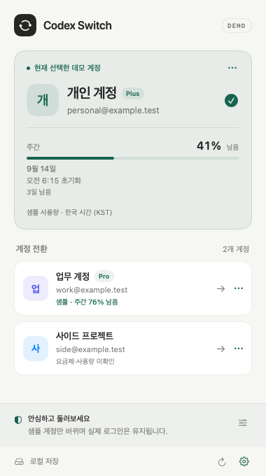

# Codex Account Toggle

[English](README.md) · [한국어](README.ko.md)

**메뉴바에서 Codex 계정을 전환하세요.**



한국어·영어 UI를 지원합니다. 시스템 언어를 따르며 설정 메뉴에서 변경할 수 있습니다. 변경 후 Codex Account Toggle만 재실행하면 적용됩니다. 날짜 표시는 선택한 언어를 따르며 시간대는 한국 시간(KST)을 유지합니다.

macOS 13 이상에서 동작하는 개인용 메뉴바 계정 전환 앱의 초기 버전입니다. Windows 시스템 트레이 버전은 아직 구현하지 않았습니다.

## 맥북 설치

macOS 13 이상, Swift 5.9 이상이 필요합니다. Xcode Command Line Tools가 없다면 `xcode-select --install`로 설치하세요. GitHub CLI(`gh`)도 설치하고 `gh auth login`으로 비공개 저장소 접근 권한이 있는 계정에 로그인한 뒤 진행합니다.

```sh
gh repo clone ChungHyup/codex-account-toggle
cd codex-account-toggle
swift test --disable-sandbox
bash scripts/build-app.sh
mkdir -p "$HOME/Applications"
ditto 'dist/Codex Account Toggle.app' "$HOME/Applications/Codex Account Toggle.app"
open "$HOME/Applications/Codex Account Toggle.app"
```

소스에서 직접 빌드하며 현재 별도 설치 파일이나 자동 업데이트는 없습니다. 로컬 ad-hoc 서명이며 개발자 서명·공증된 배포판은 아닙니다.

## 실행

`bash scripts/build-app.sh`로 빌드한 뒤 `dist/Codex Account Toggle.app`을 Finder에서 더블 클릭하세요. 메뉴바의 순환 화살표 아이콘으로 계정 목록을 엽니다. **기본 실행은 데모 모드입니다.** 개발 시 `swift test --disable-sandbox`로 테스트할 수 있습니다. 앱 아이콘은 `assets/AppIcon.icns`이며, 마크를 바꾸면 `swift scripts/make-icon.swift`로 다시 생성합니다.

## 데모 모드

요금제 배지, 주간 잔여 사용 한도 %, 초기화까지 남은 시간을 표시합니다. 데모에는 주간 한도만 제공하며 5시간 한도를 추가하지 않습니다. 데모 데이터는 명시적으로 표시한 샘플입니다. `--live` 모드에서는 로그인된 계정의 현재 주간 한도를 Codex 자체의 `codex app-server` 프로세스를 잠깐 띄워 읽습니다(소유자 승인, [AGENTS.md](AGENTS.md) 참조). 다른 저장 계정은 이 Mac의 세션 기록에 남은 마지막 값만 보여주며 조회하지 않으므로, 값을 얻기 위해 자격 증명을 바꿔 끼우는 일은 없습니다. '남음'은 토큰 잔액이 아니라 해당 시간 구간의 사용 한도 비율입니다. 실제 응답의 windowDurationMins로 구간 이름을 정하며, 누락값은 미확인, 초기화 시각이 지난 값은 새로고침 필요로 표시합니다.

공식 응답 형식의 파서, UI, 조회 전후 계정 확인 로직을 구현하고 가짜 응답으로 검증했습니다. 로그인 계정은 패널을 열 때(1분에 한 번까지)와 4분마다 조회하며, 그동안 Codex가 평소처럼 그 계정의 토큰을 갱신할 수 있습니다. 다른 저장 계정은 참고 프로젝트와 같은 방식으로 Codex 세션 기록의 사용량 줄만 읽고, 앱이 기록한 저장·전환 이력으로 계정에 귀속합니다. 원격 호스트나 Codex 클라우드에서 한 작업은 이 기록에 없습니다. 앱 밖에서 로그인이 바뀐 구간의 값은 귀속하지 않으며, 앱에 저장하기 전의 값은 처음 저장한 로그인 계정의 것으로 간주합니다. [조회 연결 준비](docs/read-only-connection.md)와 [벤치마크 결과](docs/benchmark.md)를 참고하세요.

주간 한도를 먼저 표시하며, 설정에서 표시 순서를 바꿀 수 있습니다. 메뉴바 잔여량의 `D`는 데모, `~`는 오래된 값입니다. 메뉴바 잔여량 표시도 설정에서 끌 수 있습니다.

개인·업무·사이드 프로젝트 가상 계정 3개가 표시됩니다. 계정을 클릭하면 임시 폴더 안의 가짜 인증 파일만 전환합니다. 실제 로그인 파일, 프로필 저장 폴더, Codex 프로세스에는 접근하지 않습니다. 실행할 때마다 새 임시 작업 공간이 생성됩니다.

하단 데모 설정에서 정상 전환, 종료 거부, 재실행 실패 후 복구를 선택할 수 있습니다. 계정 이름은 각 계정의 `···` 메뉴로 바꿉니다. 데모에는 실제 로그인 저장·가져오기 기능을 노출하지 않습니다. `--window` 실행 인수는 데모 패널을 별도 창으로 엽니다.

`--render-preview`는 같은 SwiftUI 화면을 `dist/demo-preview.png`에 렌더링하고 종료합니다. `--live --usage-check`는 패널을 열지 않고 실시간 조회 결과(요금제·창·오류, 토큰 제외)를 출력하고 종료합니다. 실제 앱 제어 및 실계정 접근을 수행하지 않습니다.

## 실사용 기능 (개발 중 테스트 금지)

실사용 경로는 명시적인 `--live` 실행 인수로만 활성화됩니다. 개발·테스트 중 이 인수로 실행하지 마세요. 실제 계정 전환 테스트는 사용자 명시 요청 전까지 금지합니다. 아래는 실사용 경로의 동작 설명이며, 현재 검증 완료를 의미하지 않습니다.

1. Codex에 첫 계정으로 로그인하고 **현재 로그인 계정 저장**을 누릅니다.
2. Codex에서 다른 계정으로 로그인한 뒤 다시 저장합니다. 기존 auth.json 파일 가져오기도 가능합니다. 브라우저 로그인 자체를 대신 수행하는 기능은 없습니다.
3. 목록에서 계정을 선택하고 모든 작업이 끝났음을 확인합니다. 앱은 Codex 정상 종료를 요청하고, CLI까지 종료된 것을 확인한 후 로그인만 교체하고 재실행합니다.

## 지원 범위와 현재 제약

- `com.openai.codex` macOS 앱 및 파일 기반 ChatGPT 인증을 대상으로 합니다. OS 키체인/auto/ephemeral 저장, API 키 로그인은 지원하지 않습니다.
- 현재 개발 컴퓨터의 `/Applications/ChatGPT.app`은 번들 식별자가 `com.openai.codex`임을 확인했습니다. 파일명 대신 이 식별자로 앱을 찾습니다. 실제 계정 전환 호환성은 아직 검증하지 않았습니다.
- 실행 중인 작업의 상태를 조회하는 공개 API를 연결하지 않았습니다. 사용자가 완료 여부를 확인하고, 앱은 종료 후 남은 Codex 프로세스를 검사합니다. 강제 종료하지 않습니다.
- UI의 '현재' 표시는 로컬 로그인 파일 기준입니다. 재실행 성공은 서버 로그인 성공을 의미하지 않습니다. 만료·취소된 토큰은 Codex에서 재로그인이 필요합니다.
- 실제 계정 전환 및 프로젝트·대화 보존은 아직 실기기 통합 테스트가 필요합니다. 자동 테스트는 임시 파일만 사용합니다.

## 로컬 저장과 복구

기본 `~/.codex/auth.json` 또는 실행 환경의 `CODEX_HOME/auth.json`을 사용합니다. 계정 사본은 `~/Library/Application Support/CodexSwitch`에 저장합니다. 폴더 0700, 파일 0600 권한의 **평문**이므로 macOS 로그인 사용자와 관리자에게는 읽힐 수 있습니다. 앱 자체의 네트워크 요청과 토큰 로그는 없으며, 사용량 조회는 앱이 띄우고 끄는 `codex app-server` 프로세스가 수행합니다. 세션 기록은 사용량 줄만 추출하고 대화 내용은 읽거나 저장하지 않습니다.

로그인 교체 전 `recovery.auth.json`을 보존합니다. 교체/실행 실패 시 Codex 프로세스가 없을 때 복구합니다. 실행 중이거나 앱이 중단되면 복구 파일을 유지하고 다음 실행에서 복구 버튼을 표시합니다. Codex와 CLI를 종료한 후 복구하세요. 재실행에 성공하면 임시 복구 파일을 삭제합니다.

프로젝트, 대화, 스킬, 설정 파일은 변경하지 않습니다. 설정 파일은 인증 저장 방식 확인 목적으로만 읽습니다. 다른 앱·CLI가 동시에 인증을 변경하는 상황은 지원하지 않습니다.

## 참고

구현 검토: [docs/review.md](docs/review.md). 코드 서명은 로컬 ad-hoc이며 개발자 서명/공증·배포 설치 프로그램·Windows 지원은 포함하지 않습니다.

## 공개 준비

[기여 안내](CONTRIBUTING.md), [보안 안내](SECURITY.md), [변경 기록](CHANGELOG.md), [공개 준비 항목](docs/publication.md)을 참고하세요. [MIT 라이선스](LICENSE)를 적용합니다. 저작권자는 Chunghyup OH이며 현재 저장소는 개인 QA용 비공개로 운영하며 공개 전환은 추후 결정합니다.

이전 앱 이름은 Codex Switch입니다. 계정 저장 경로는 호환성을 위해 유지하며 인증정보를 이동하지 않습니다. 이전 이름의 유틸리티가 열려 있으면 직접 종료한 뒤 새 앱을 여세요. 새 앱 식별자에서는 언어·표시 설정이 기본값으로 시작합니다.

## 맥북에서 직접 실계정 QA

먼저 기본 데모로 표시·언어·테마·전환 실패 시나리오를 확인하세요. 로그인 계정은 실시간 조회 값을, 다른 저장 계정은 이 Mac에 기록된 마지막 값이 있을 때만 표시합니다.

두 실제 계정 테스트를 시작할 때는 Codex 작업을 모두 마치고 CLI 세션을 종료하세요. **Codex Account Toggle 유틸리티 자체를 종료**한 다음 아래 명령으로 실행해야 기존 데모 인스턴스와 겹치지 않습니다.

```sh
open "$HOME/Applications/Codex Account Toggle.app" --args --live
```

이 명령은 사용자가 직접 선택한 QA용이며 개발 자동화에서 실행하지 않습니다. 계정 A를 저장하고, Codex에서 직접 B에 로그인한 뒤 B도 저장하세요. B→A→B 전환, 재시작 후 Codex 내부의 실제 계정, 프로젝트·대화 유지 여부를 확인하세요. 확인창에서 취소했을 때 기존 계정이 유지되는지도 확인합니다. 실제 계정으로 장애를 억지로 만들지 말고 종료 거부·복구는 데모 시나리오로 검증하세요.

다음에 더블 클릭하면 다시 데모로 시작합니다. `--live` 설정은 저장하지 않습니다. QA 결과에는 인증 파일·토큰·개인 계정 정보가 담긴 스크린샷을 첨부하지 마세요.
