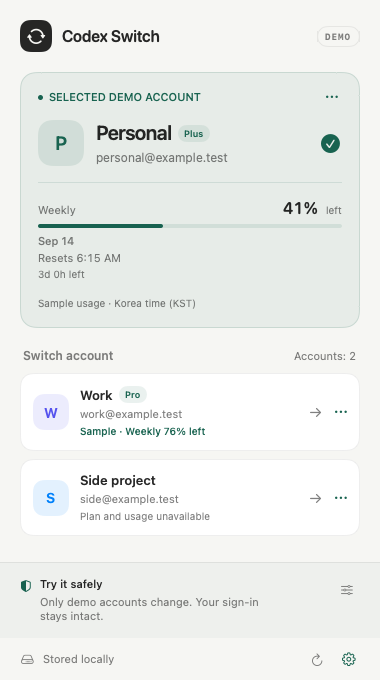

# Codex Switch

[English](README.md) · [한국어](README.ko.md)

A small macOS menu-bar utility for choosing between saved Codex accounts. Built with SwiftUI and AppKit. **Experimental and demo-first; not affiliated with OpenAI.**



## What works today

- Three synthetic accounts in demo mode, account renaming, and simulated switching/recovery.
- Korean and English UI, light/dark themes, and visible account management menus.
- Sample plan badges, weekly-only demo quota percentages, and exact reset dates/countdowns in Korea time (KST).
- Weekly-first display and optional menu-bar quota (`D` marks demo data; `~` marks an old reading).
- Core tests for credential-file validation, private file permissions, backups, recovery, dates, and translations.

The [current-account reader](docs/read-only-connection.md) is prepared and tested with synthetic responses; its production transport remains disconnected. See the [account-switcher benchmark](docs/benchmark.md) for adopted behaviors and follow-up work.

## Important limits

The default app never accesses real sign-in files or controls Codex. Usage and plans are **samples**, not live account readings. Quota windows are shown only when present in the supplied data; a five-hour limit is not assumed for every account. A quota percentage is not a token balance.

Real switching exists behind an explicit `--live` argument but is **not end-to-end validated**. It targets file-based ChatGPT credentials and the `com.openai.codex` app identifier. Keychain/auto/ephemeral credentials, API-key sign-in, Windows, production signing/notarization, and live usage collection are not supported. Do not use real sessions in development or automated testing.

## Build and try the demo

Requires macOS 13+, Swift 5.9+, and Xcode Command Line Tools. No third-party package dependencies.

```sh
swift test --disable-sandbox
bash scripts/build-app.sh
```

Open `dist/Codex Switch.app`, then click its circular-arrows menu-bar icon. Choose a demo account. The lower settings control simulates success, refused quit, or launch failure/recovery. Use each account's `…` menu to rename it.

The language follows macOS (Korean, otherwise English). The gear menu lets you choose System, 한국어, or English; reopen **Switch** to apply. This never requires restarting Codex. Date labels are localized while their timezone stays explicitly KST.

For deterministic visual checks:

```sh
'dist/Codex Switch.app/Contents/MacOS/CodexSwitch' --render-preview --language=en
'dist/Codex Switch.app/Contents/MacOS/CodexSwitch' --render-preview --language=ko --dark
```

These render synthetic data only. `--window` opens the demo in a small standalone window. Demo workspaces are created under the system temporary directory and are not committed.

## Credential handling

Experimental live mode reads `CODEX_HOME/auth.json` (default `~/.codex/auth.json`) and stores snapshots under `~/Library/Application Support/CodexSwitch`. Files are plaintext with mode 0600; the directory uses 0700. This is file-permission protection, not encryption. The app itself has no telemetry or network client. Project/session/skill/config files are not intentionally modified.

Switching is designed to request a normal quit, confirm Codex processes are gone, back up the prior sign-in, replace the file, and reopen the app. Recovery is deferred when a process may still be using credentials. These file-level checks do not prove successful server authentication. See [security notes](SECURITY.md) and [implementation review](docs/review.md).

## Contributing and publication

See [CONTRIBUTING.md](CONTRIBUTING.md), [CHANGELOG.md](CHANGELOG.md), and [publication readiness](docs/publication.md). macOS CI runs synthetic tests, source checks, and the app build; its first hosted run is pending repository creation.

Licensed under the [MIT License](LICENSE), copyright © 2026 Chunghyup OH. The reference project [ScWen7/CodexSwitch](https://github.com/ScWen7/CodexSwitch) is also MIT-licensed. This is a new Swift implementation; no reference source is vendored.
