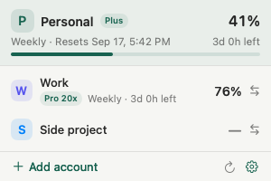
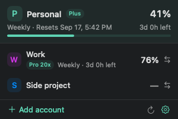

<p align="center"></p>

<p align="center">
  <a href="https://github.com/ChungHyup/codex-account-toggle/releases/tag/v0.2.0-beta.1"><b>Download for macOS</b></a> ·
  <a href="README.ko.md">한국어</a> ·
  <a href="https://github.com/ChungHyup/codex-account-toggle/issues">Report an issue</a>
</p>

<p align="center">
  
  
  <a href="LICENSE"></a>
  <a href="https://github.com/ChungHyup/codex-account-toggle/actions/workflows/ci.yml"></a>
</p>

A small, native menu-bar app for people who use more than one Codex account. Keep personal and work accounts close, check the available quota, and choose the account you want to use next.

**No dashboard to manage. No logout routine to repeat. Just your accounts, one click away.**

## A small menu. The details that matter.

| Light | Dark |
| :---: | :---: |
|  |  |

*Actual app views rendered with fictional accounts and sample quota. These are design previews, not readings from a real account.*

- **Add another account without logging out.** Browser sign-in runs in a temporary Codex home, then saves the new account locally.
- **Switch with a clear confirmation.** See which account you chose and whether Codex needs to restart. Cancel is the default.
- **See quota before you switch.** The signed-in account gets a live reading. Inactive accounts show a last known local reading when it can be attributed; missing values stay unknown.
- **Make the menu yours.** Rename or remove saved accounts, show quota in the menu bar, and choose English or Korean. Light and dark appearance follow macOS.
- **Keep control of your data.** No app-operated cloud sync or analytics. Authentication is handled by Codex; saved sign-in copies stay on your Mac.

## Install

1. Download **Codex-Account-Toggle-0.2.0-beta.1-universal.dmg** from [Releases](https://github.com/ChungHyup/codex-account-toggle/releases/tag/v0.2.0-beta.1).
2. Open the DMG and drag **Codex Account Toggle** to **Applications**.
3. Open the app and click the circular-arrows icon in your menu bar.

**This is a beta, locally ad-hoc signed and not notarized.** macOS blocks it on first launch; approving it takes one trip to System Settings (below). If your organization's policy does not allow that, build from source instead. There is no automatic updater yet.

### If macOS blocks the app

This approves only this app; it does not lower system security in general.

- **macOS 15 (Sequoia) and later:** open the app once and dismiss the "Apple could not verify" dialog, then open **System Settings → Privacy & Security**, scroll to the security section, click **Open Anyway** next to Codex Account Toggle, and confirm.
- **macOS 13–14:** Control-click the app in Applications, choose **Open**, then click **Open** in the dialog.
- **Terminal alternative:** remove the download quarantine flag from this app only:

```sh
xattr -d com.apple.quarantine "/Applications/Codex Account Toggle.app"
```

Requires **macOS 13+** and an installed **Codex desktop app** for real account switching. The DMG includes both Apple Silicon and Intel code; Intel compilation is verified, but Intel hardware QA is still pending.

## First real account

A fresh install opens a safe demo. Choose **Switch to real accounts** in the gear menu when you are ready.

1. **Add account → Save signed-in account** saves the account already open in Codex.
2. **Add account → Sign in to another account…** opens browser sign-in for another account. Give it a recognizable name.
3. Finish your Codex work and close CLI sessions. Click the account you want, then confirm the switch/restart.

Do not log out of Codex just to add another account: logout can invalidate a saved sign-in. The app never forces your running Codex or CLI to quit. If normal shutdown does not complete, it stops before replacing the sign-in. Verify the selected account inside Codex after switching.

Real-account mode is remembered. Choose demo mode in settings to go back. The app targets **file-based ChatGPT authentication**; API-key and Keychain/auto/ephemeral credentials are unsupported.

## What quota means

The percentage is remaining **usage allowance**, not a count of tokens. Only quota windows supplied by Codex are shown. Inactive accounts are not signed in or polled just to obtain usage. Their local history may be incomplete or ambiguous; timestamps matter. Reset dates currently use **Korea time (KST)**.

The live read starts a short-lived `codex app-server`; Codex may refresh the active account's credentials. Local rollout files are read to extract quota events, and unrelated content is discarded. See [usage details](docs/usage.md).

## Build from source

Install Xcode Command Line Tools (`xcode-select --install`) and use Swift 5.9+. No third-party Swift package dependencies.

```sh
git clone https://github.com/ChungHyup/codex-account-toggle.git
cd codex-account-toggle
swift test --disable-sandbox
bash scripts/build-app.sh
open 'dist/Codex Account Toggle.app'
```

To build a universal DMG with full Xcode installed:

```sh
UNIVERSAL=1 bash scripts/build-app.sh
bash scripts/package-dmg.sh
```

[Development and manual QA guide](docs/qa.md) · [Release review](docs/release-review-0.2.0.md) · [Changelog](CHANGELOG.md)

## Security & contributions

Saved sign-ins are **plaintext files protected by filesystem permissions** (directory 0700, files 0600), not encrypted vault entries. They remain under `~/Library/Application Support/CodexSwitch` for compatibility with the previous app name. Never upload that directory or `auth.json` in an issue. See [SECURITY.md](SECURITY.md) for the full model and supported scope.

Found a rough edge? [Open an issue](https://github.com/ChungHyup/codex-account-toggle/issues) with your macOS version and reproducible steps, without account secrets. Contributions are welcome; start with [CONTRIBUTING.md](CONTRIBUTING.md). Windows, notarized distribution, and an automatic updater are not included in this release.

## License & acknowledgments

[MIT](LICENSE) © 2026 Chunghyup OH. Independent software; not affiliated with or endorsed by OpenAI.

Design and implementation research included [ScWen7/CodexSwitch](https://github.com/ScWen7/CodexSwitch) and [liuzhao1225/codex-account-switcher](https://github.com/liuzhao1225/codex-account-switcher). Their code and artwork are not bundled. Our logo is generated from original vector geometry; see [reference review](docs/provenance-review.md).
